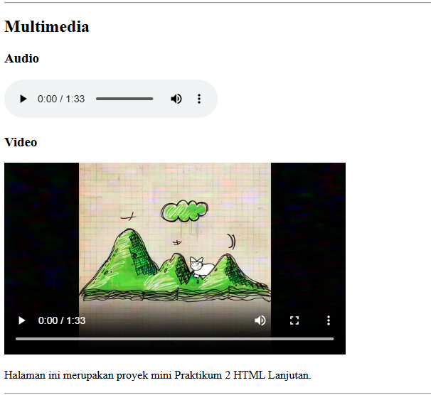
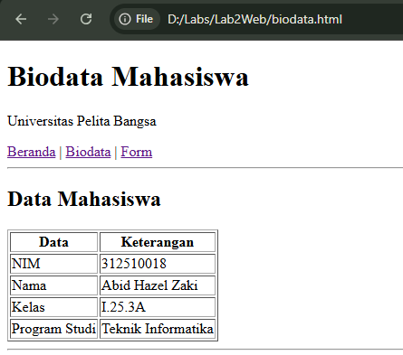

# Lab2Web

## Praktikum 2 - HTML Lanjutan

**Nama:** Abid Hazel Zaki  
**NIM:** 312510018  
**Kelas:** I.25.3A  
**Mata Kuliah:** Pemrograman Web

---

## Tujuan

Praktikum ini bertujuan untuk mempelajari HTML lanjutan, meliputi:

- Membuat tabel HTML
- Membuat form HTML
- Menggunakan berbagai tipe input
- Menggunakan radio button dan checkbox
- Menggunakan select dan textarea
- Menerapkan validasi form
- Menggunakan semantic HTML
- Menambahkan multimedia berupa audio dan video
- Membuat mini project biodata mahasiswa

---

## Hasil Praktikum

### 1. Tabel Data Mahasiswa


### 2. Tabel Nilai Praktikum


### 3. Form Registrasi


### 4. Radio Button dan Checkbox


### 5. Select dan Textarea


### 6. Validasi Form


### 7. Semantic HTML


### 8. Multimedia



### 9. Biodata Mahasiswa



### 10. Form Biodata


---

## Struktur Folder

```text
Lab2Web/
│
├── index.html
├── biodata.html
├── README.md
│
├── media/
│   ├── audio.mp3
│   └── video.mp4
│
└── Screenshot/
    ├── Tabel_Data_Mahasiswa.png
    ├── Tabel_Nilai_Praktikum.png
    ├── Form_Registrasi.png
    ├── Radio_Checkbox.png
    ├── Select_TextArea.png
    ├── Validasi_Form.png
    ├── Semantic_HTML.png
    ├── Multimedia.png
    ├── Biodata.png
    └── Form_Biodata.png